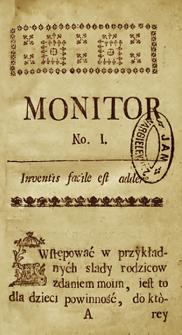
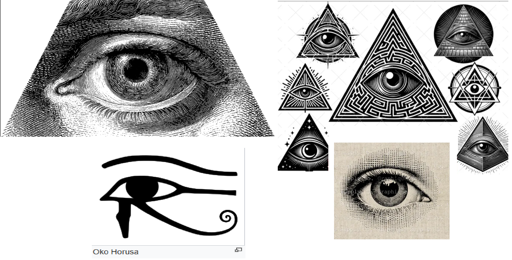
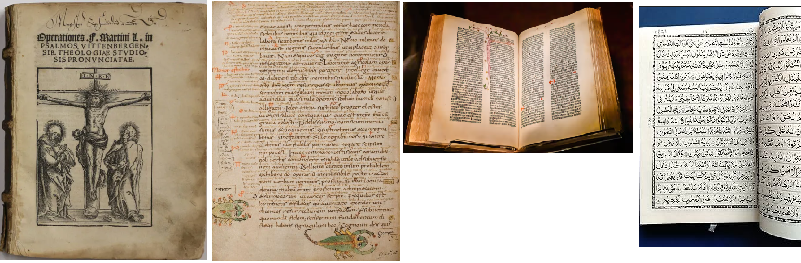

# Semantyka logo

Pierwotna idea nazwy "Monitor" wywodzi się bezpośrednio z definicji tego słowa z telekomunikacji/kubernetes/etsi. W kontraście to "fetch" Monitor to coś więcej niż zaciąganie danych z racji, że prezentuje je (jako widok w Google Sheets), w kontraście do Observe, które jest bierne celem Monitor jest podjęcie konkretnych akcji na podstawie obserwowanych danych.

Nazwa ta też niesamowicie się przyjęła z racji staropolskiego [czasopisma o nazwie "Monitor"](https://pl.wikipedia.org/wiki/Monitor_(czasopismo)), co pasuje do natury projektu, gdyż Monitor jest przeze mnie przeglądany codziennie niczym gazeta.

Na końcu okazuje się, że Monitor był czasopismem oświeceniowym, głoszącym hasło łac. *"Facile est inventis addere"* (pl. *"Do rzeczy już wynalezionych łatwo jest dodawać."*). Co też pasuje do natury projektu (oraz mojego kierunku na 2026).

Stąd powstał następujący rdzeń ideowy:
1. Monitor
    - obserwacja, czujność, krytyczne myślenie
2. Oświecenie
    - rozum, porządkowanie, postęp przez iterację
3. Inventis facile est addere
    - dodawanie do istniejącego
    - ciągłość rozwiązań

Od razu do głowy przychodzi więc symbolika:
- [Oka opatrzności (Oświecenie)](https://pl.wikipedia.org/wiki/Oko_opatrzno%C5%9Bci)
- [Trzecie oko (Hinduzm)](https://pl.wikipedia.org/wiki/Trzecie_oko)
- Margines & Glosa - jako nazwiązanie do:
    - książek czasopism oraz idei, że
    - wiedza/postęp nie powstaje w próżni, a na **marginesach**
- [Oświecenie](https://en.wikipedia.org/wiki/Age_of_Enlightenment) - Oko Opatrzności, symbol boskiej wszechwidzącej interwencji, jest ściśle powiązane z Oświeceniem, ponieważ podczas tego okresu zyskało nowe znaczenia związane z **nauką, rozumem i poszukiwaniem prawdy**, jednocześnie zachowując swoje religijne korzenie jako Bóg-Architekt czuwający nad ludzkością.

Tak więc logo ma łączyć dwa kierunki:

### Oko oświecenia

**Symbol**

- stylizowane oko opatrzności
- bez trójkąta masońskiego, bez religi
- z odwóbką [oka horusa](https://pl.wikipedia.org/wiki/Oko_Horusa) z racji, że to najstarsza wizualizacja konceptu oka opatrzności

**Forma**
- cienkie linie
- symetria
- lekko niedoskonałe linie (jak druk w XVIII w.)

**Ukryta metafora**
- oko = monitor
- linie wokół = warstwy wiedzy/rozwoju
- brak źrenicy -> brak "prawdy objawionej"

### Margines & glosa

**Symbol**
- prostokąt jako strona 
- linia boczna (margnies)
- mały znak "+" / kreska / punkt

**Forma**
- symetria
- doskonałość

**Ukryta metafora**
- wiedza/rozwój powstaje na marginesach
- intelektualny wydźwięk (w kontraście do duchowego oka)

