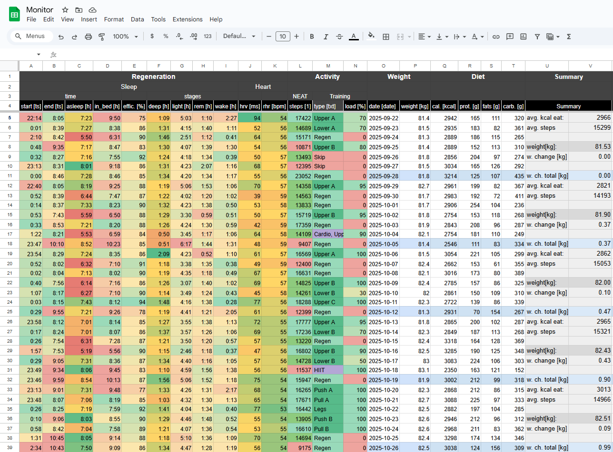

  
   
  <i>Monitor przerzuca mi dane z zegarka Fitbit oraz Dietonez do google Sheets</i>
   

# Architektura

# Result

Koloumny:
- "type [txt]"
- "load [%]"
- "weight [kg]"
- "Summary"

Wypełniane są ręcznie lub poza [job.py](job.py).